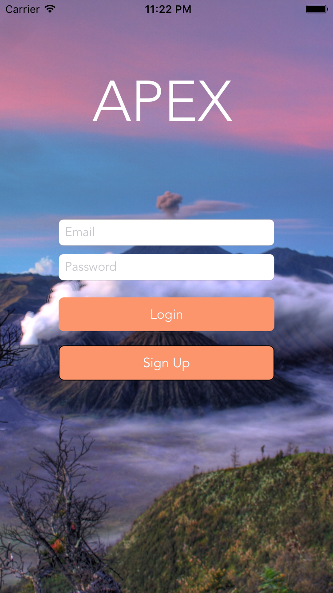
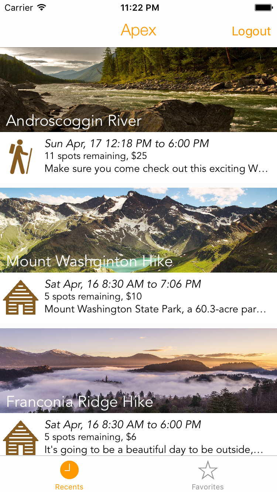
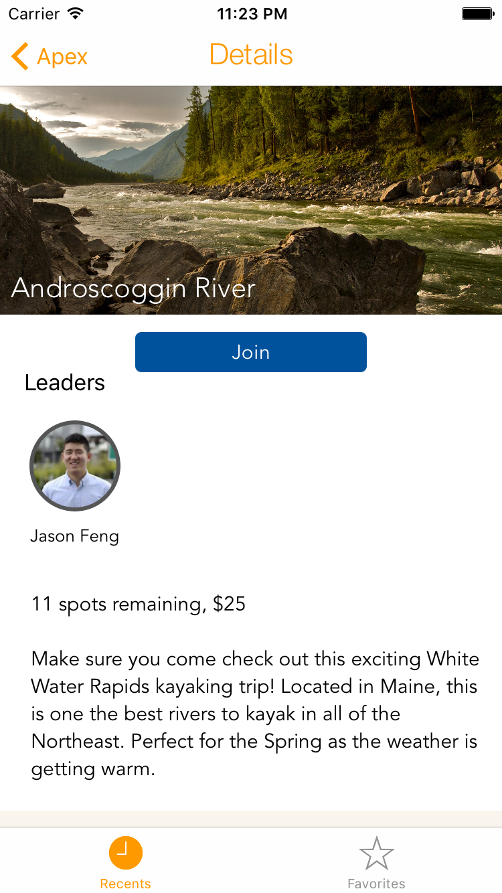

# Apex, beautiful, simple trip organization

### Inspiration
The Dartmouth Outing Club is an essential part of the Dartmouth community, organizing trips weekly for different types of activities and people. However, the way these trips are organized is very inefficient and not conductive to new members. Different groups have different methods of conducting their trip signups, some use massive email chains while others have Google spreadsheets. Apex is inspired by the DOC to make trip organization seamless and simple for interested students and organizers.

###  What it does
Users can sign up with only their email and password. After registering, users are directed towards upcoming trips. Clicking on a trip brings you to a more detailed view of the trip including a description, remaining spots on the trip, the location on a map, and images related to the event. If interested, a user can choose to join a trip. There is also a separate tab to view all of the trips a user has already signed up for.

###  How we built it
Apex is built using Firebase, a Google platform as a service technology that provides an on-the-fly NoSQL database, perfect for prototyping and iOS.

###  What's next for Apex
- Messaging client to send messages to all members in a group
- Calendar integration through calendar events
- Payment integration with Venmo API
- Event subscription for updates on events occurring in a specific area, when a spot opens up in a group, or an activity type

### Installation

`pod install`

use `Apex.xcworkspace`
